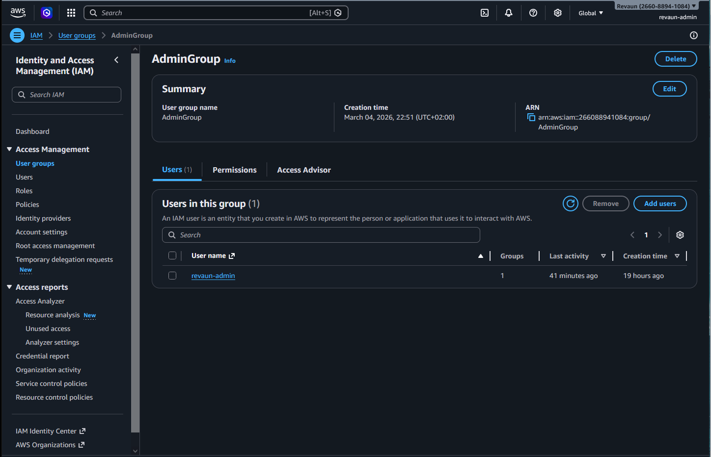
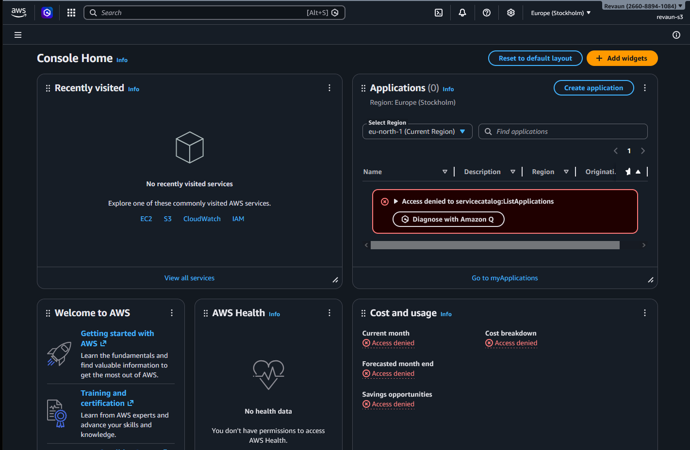
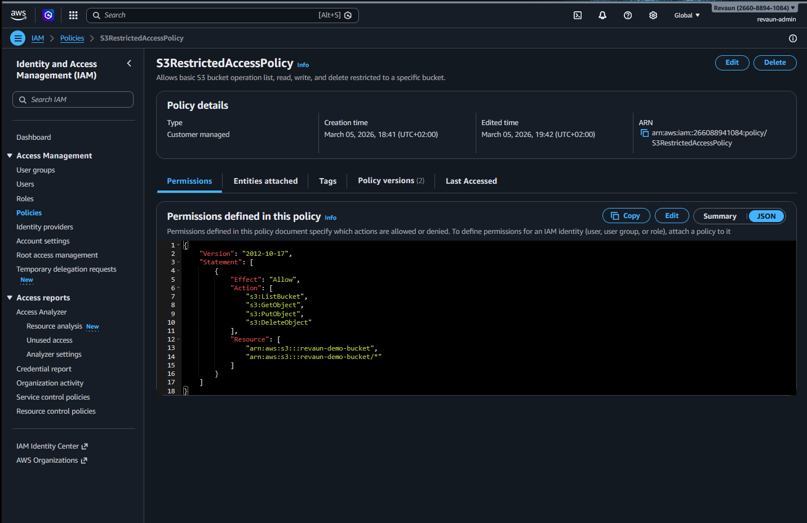
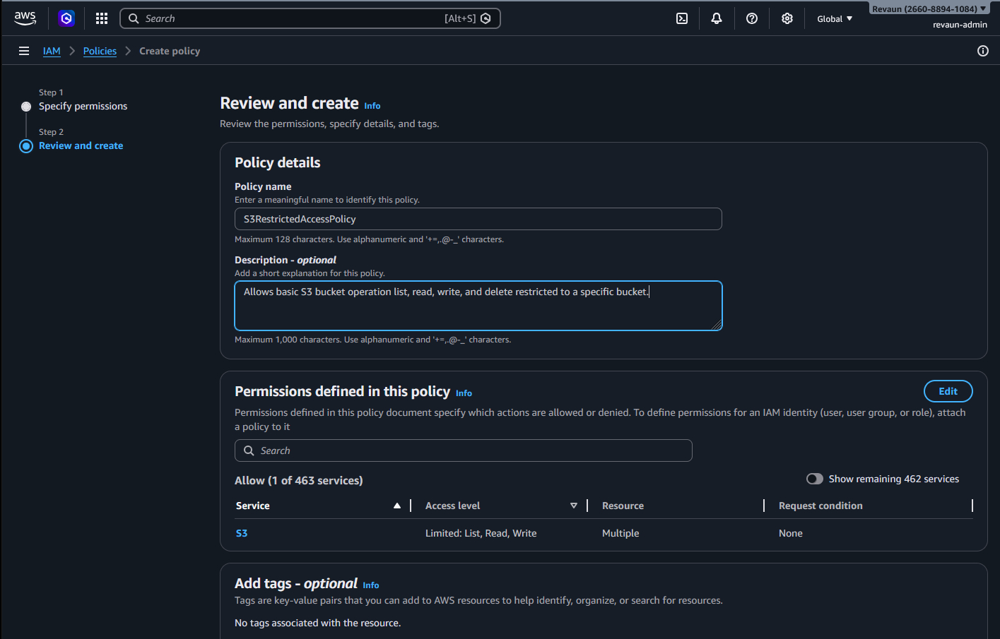
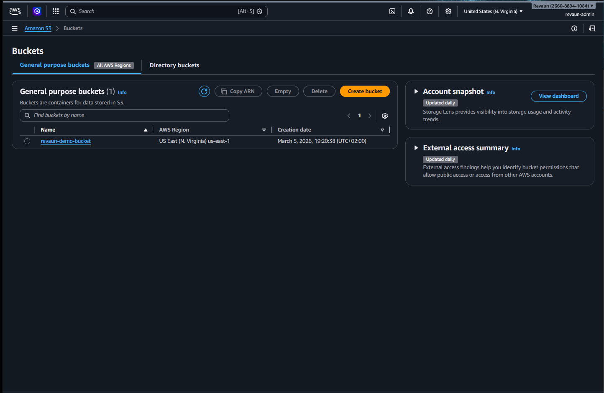
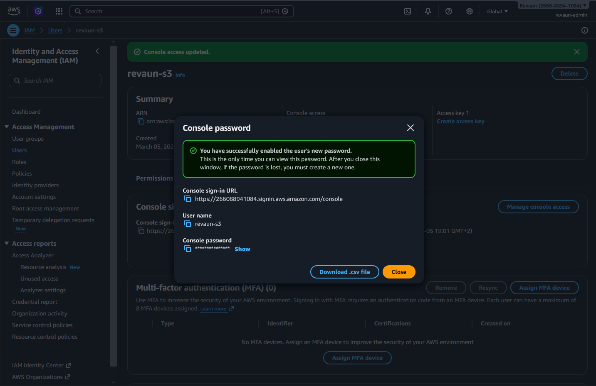
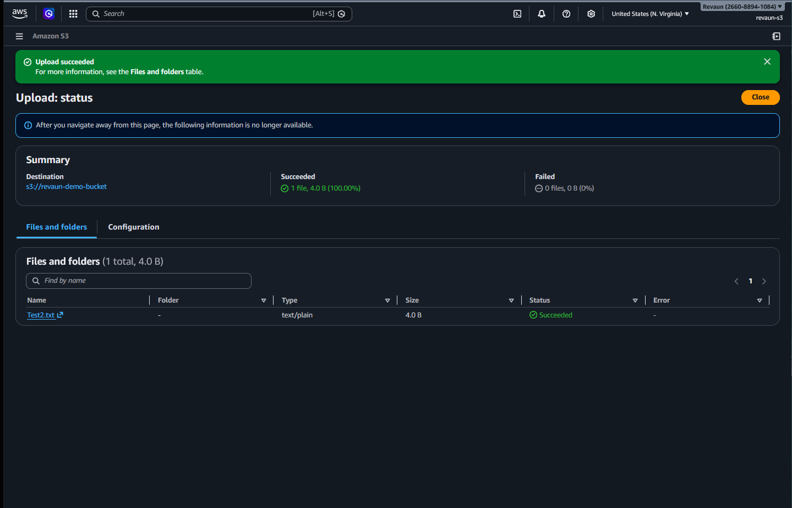
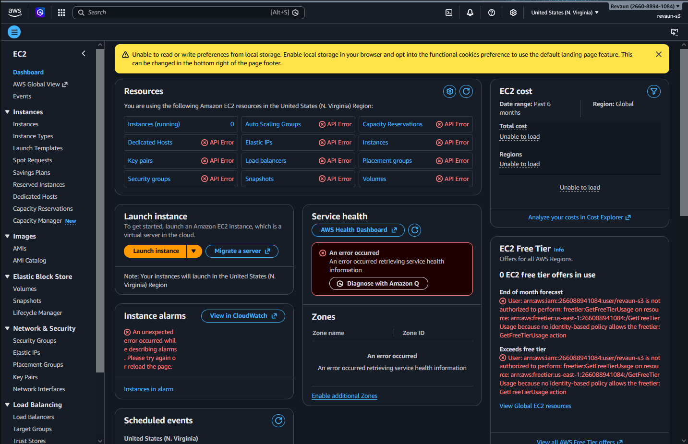
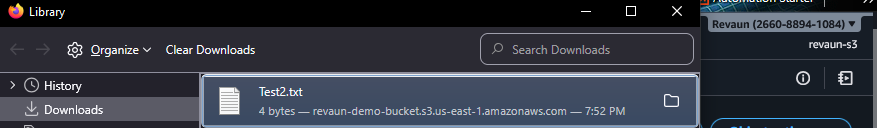
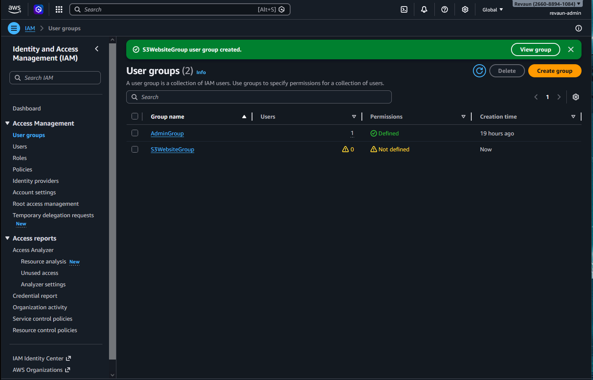

# AWS IAM Security Demo

This project demonstrates IAM best practices, least privilege, and S3 access control.

## Project Objectives
- Demonstrate IAM best practices in AWS
- Show least privilege enforcement with custom policies
- Document secure S3 bucket creation and access control
- Provide recruiter‑ready evidence of hands‑on AWS security skills

## Key Learnings
- How to create and manage IAM users and groups
- Writing and testing custom JSON policies
- Enforcing least privilege with access denied scenarios
- Configuring S3 buckets for secure uploads and downloads
- Documenting cloud security projects for professional review

## Screenshots

### Admin & Restricted Users
  

### Policies
  

### S3 Bucket & Uploads
  
  

### Access Control
  
  

### Groups & Overview
  

